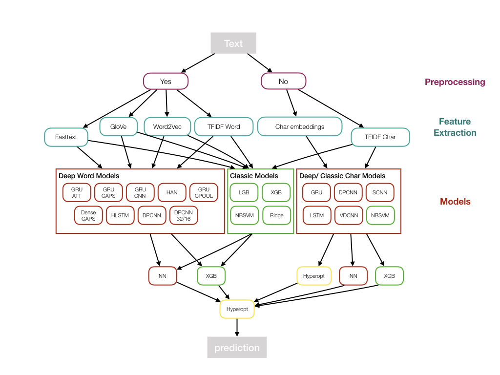

# kaggle_toxic_comments
This repository is a collection of models and scripts used for the 53rd Place Solution of the toxic comments challenge hosted on kaggle

TODOS:
- add models
- test models 1 by 1
- add preprocessing scripts

### Model Explanations and references

#### GRU ATT
RNN with GRU cells and Average weighted attention layer

#### GRU CAPS
RNN with GRU cells topped with Capsules

https://arxiv.org/abs/1710.09829

#### HAN
Hierarchy attention network

https://www.cs.cmu.edu/~hovy/papers/16HLT-hierarchical-attention-networks.pdf

#### HLSTM
Hierarchy attention network with LSTM cells

#### NBSVM
Naive Bayes Logistic Regression

#### XGB
Gradient boosting with the xgboost package

https://xgboost.readthedocs.io/en/latest/

#### LGB
Gradient boosting with the light gradient boost package

### Instructions

#### Folder structure

- assets
  - train.csv
  - test.csv
  - sample_submission
  - glove.twitter.27B.200d.txt (GloVe embeddings)
  - crawl-300d-2M.vec (fasttext embeddings)